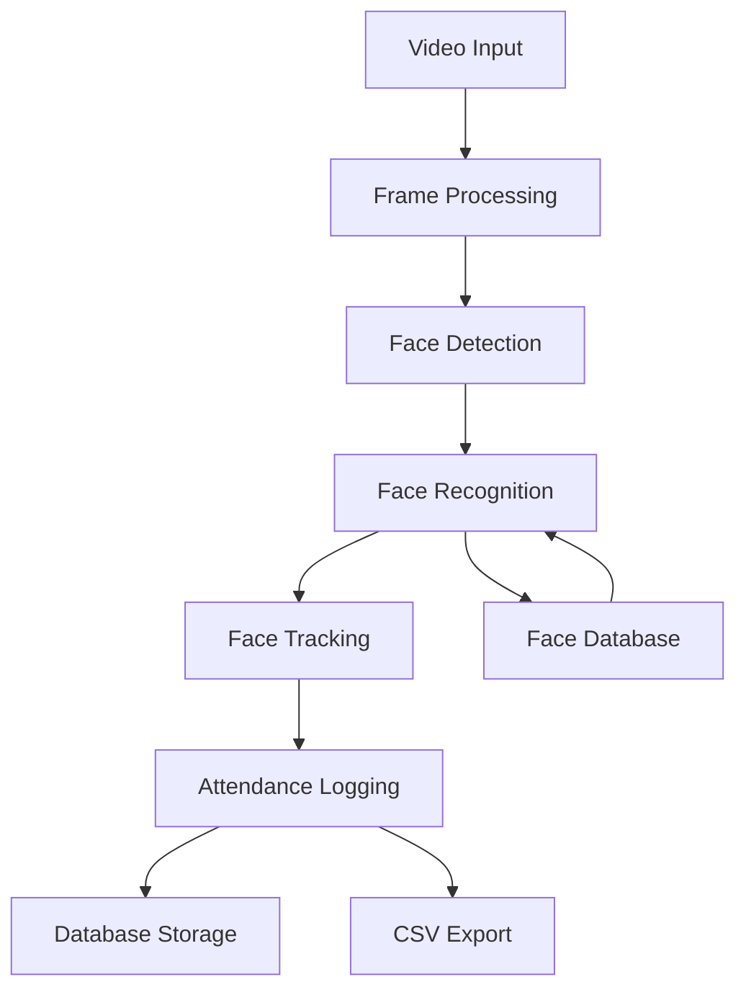

# Face Recognition Attendance System - Technical Documentation

## System Architecture Overview



## Core Components

### 1. Video Processing Pipeline

#### Frame Capture and Processing
- **Input Resolution**: Full HD (1920x1080)
- **Frame Rate**: 30 FPS target
- **Processing Steps**:
  1. Frame capture using OpenCV
  2. Resolution optimization
  3. Color space conversion
  4. Frame buffering

#### Optimization Features
- Frame buffer size: 30 frames
- Smart frame dropping
- Memory pooling for frame objects
- Batch processing support

### 2. Face Detection & Recognition

#### Detection System
- **Technology**: InsightFace detector
- **Features**:
  - Multi-scale detection
  - Confidence scoring
  - Batch processing capability
  - Worker thread pool (6 workers)

#### Recognition Pipeline
- Face embedding generation
- Distance-aware weighting
- Multi-scale recognition
- Confidence thresholding

### 3. Database Architecture

#### Schema Design
```sql
-- Users Table
CREATE TABLE users (
    id INTEGER PRIMARY KEY,
    name TEXT NOT NULL,
    created_at DATETIME DEFAULT CURRENT_TIMESTAMP
);

-- Face Samples Table
CREATE TABLE face_samples (
    id INTEGER PRIMARY KEY,
    user_id INTEGER,
    image_path TEXT NOT NULL,
    FOREIGN KEY (user_id) REFERENCES users(id)
);

-- Attendance Records Table
CREATE TABLE attendance (
    id INTEGER PRIMARY KEY,
    user_id INTEGER,
    date DATE DEFAULT CURRENT_DATE,
    check_in_time DATETIME,
    check_out_time DATETIME,
    FOREIGN KEY (user_id) REFERENCES users(id)
);
```

#### Storage Optimizations
- Binary face embedding storage
- Compressed image storage
- Efficient database indexing
- Regular cleanup routines

### 4. Performance Optimizations

#### Processing Optimizations
- Worker thread enhancement
- Frame skipping implementation
- Batch processing
- Smart resource allocation

#### Memory Management
- Enhanced frame buffer
- Memory pooling
- Smart frame dropping
- Cached image processing

#### Display Pipeline
- Optimized image resizing (BILINEAR)
- Frame caching
- Efficient color space conversion

## Main Functions

### 1. Initialization
```python
def initialize_system():
    # Initialize database connection
    # Setup face detection model
    # Configure video capture
    # Start worker threads
```

### 2. Face Processing
```python
def process_frame(frame):
    # Preprocess frame
    # Detect faces
    # Generate embeddings
    # Match with database
    # Update tracking
```

### 3. Attendance Management
```python
def log_attendance(user_id):
    # Verify user presence
    # Update database
    # Generate CSV records
    # Handle check-in/check-out
```

## Performance Metrics

### Current Performance
- FPS Range: 10-20 FPS
- Detection Pool: 4 workers
- Frame Buffer: 10 frames

### Optimized Targets
- Target FPS: 45 FPS average
- Enhanced Worker Pool: 6 workers
- Increased Buffer Size: 30 frames

### Optimization Results
- Processing Optimizations: +15-20 FPS
- Memory Management: +5-8 FPS
- Display Pipeline: +8-10 FPS

## Error Handling

### Critical Error Scenarios
1. Database Connection Failures
2. Camera Access Issues
3. Face Detection Model Errors
4. Memory Overflow Situations

### Recovery Procedures
1. Automatic reconnection attempts
2. Graceful degradation options
3. Error logging and monitoring
4. Automatic system recovery

## System Requirements

### Hardware Requirements
- CPU: Multi-core processor
- RAM: Minimum 8GB
- Storage: 1GB+ for database and face samples
- Camera: HD webcam capability

### Software Dependencies
```txt
Core Requirements:
- opencv-python>=4.5.0
- numpy>=1.19.0
- insightface>=0.6.0
- sqlalchemy>=1.4.0
- pillow>=8.0.0
- scipy>=1.7.0

Optional Dependencies:
- pandas (attendance analysis)
- matplotlib (visualization)
- onnxruntime (optimized inference)
```

## Maintenance Procedures

### Regular Maintenance
1. Database optimization
2. Face sample cleanup
3. Log rotation
4. Performance monitoring

### Backup Procedures
1. Database backups
2. Face sample backups
3. Configuration backups
4. Attendance record exports

## Security Considerations

### Data Protection
- Encrypted storage
- Secure face embedding storage
- Protected attendance records
- Access control implementation

### Privacy Measures
- Data retention policies
- User consent management
- Data anonymization options
- Access logging

## Future Improvements

### Planned Enhancements
1. GPU acceleration support
2. Cloud backup integration
3. Mobile application support
4. Advanced analytics features

### Scalability Considerations
1. Distributed processing
2. Cloud database integration
3. Load balancing implementation
4. Horizontal scaling options