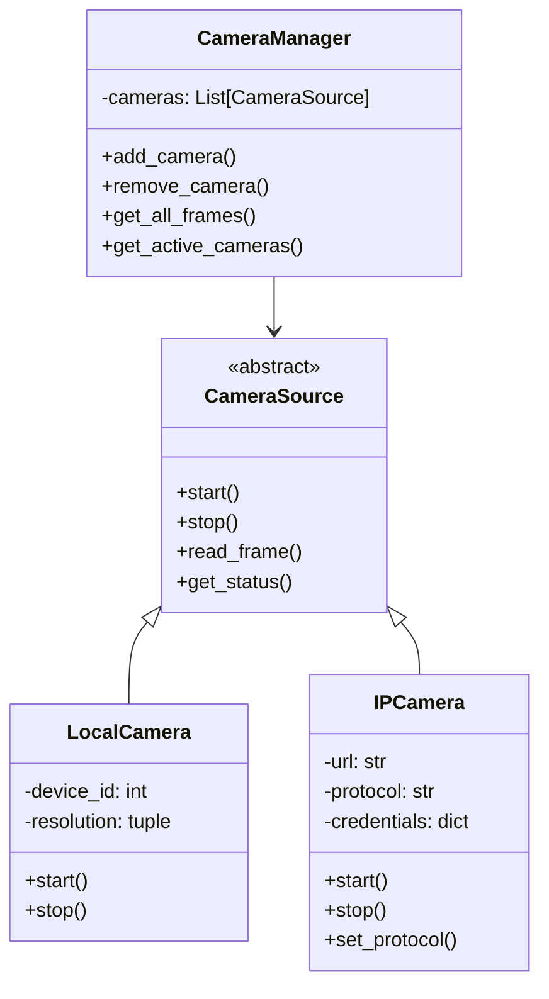
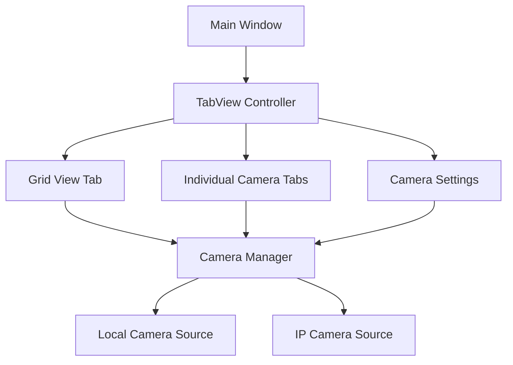

# Camera System Enhancement Plan

## Overview
This document outlines the plan for enhancing the camera system to support multiple cameras, tabbed views, and IP camera integration.

## Architecture

### Camera Infrastructure

### UI Components

## Implementation Details

### 1. Camera Infrastructure

#### CameraSource (Abstract Base Class)
- Common interface for all camera types
- Status monitoring and error handling
- Frame rate control and optimization

#### Camera Types
1. LocalCamera
   - Enhanced webcam support
   - Resolution and FPS configuration
   - Auto-reconnect capabilities

2. IPCamera
   - Support for RTSP and HTTP streaming
   - Connection management and recovery
   - Bandwidth optimization
   - Phone camera integration via IP camera apps

#### CameraManager
- Dynamic camera registration/deregistration
- Resource management
- Performance monitoring
- Frame synchronization

### 2. UI Components

#### TabView System
1. Grid View Tab
   - Flexible grid layout adapting to screen size
   - Auto-scaling camera views
   - Performance-optimized rendering
   - Camera status indicators

2. Individual Camera Tabs
   - Detailed view of single camera
   - Camera-specific controls
   - Status information
   - Face detection overlay

3. Settings Dialog
   - Camera configuration
   - Stream protocol selection
   - Resolution/quality settings
   - Network settings for IP cameras

### 3. Implementation Phases

#### Phase 1: Camera Infrastructure (Week 1)
- [ ] Implement CameraSource abstract class
- [ ] Develop LocalCamera enhancements
- [ ] Create IPCamera implementation
- [ ] Build CameraManager

#### Phase 2: UI Components (Week 2)
- [ ] Implement TabView system
- [ ] Create GridView component
- [ ] Develop individual camera views
- [ ] Add camera configuration dialogs

#### Phase 3: Integration & Testing (Week 3)
- [ ] Integrate all components
- [ ] Performance optimization
- [ ] Error handling
- [ ] User testing

## Technical Considerations

### Performance
- Frame buffer management
- Multi-threading for camera handling
- UI rendering optimization
- Memory management for multiple streams

### Network
- Connection pooling for IP cameras
- Bandwidth management
- Error recovery
- Security considerations

### User Experience
- Intuitive camera management
- Clear status indicators
- Smooth tab switching
- Responsive grid layout

## Future Enhancements
1. Camera presets
2. Advanced streaming protocols
3. Cloud integration
4. Recording capabilities