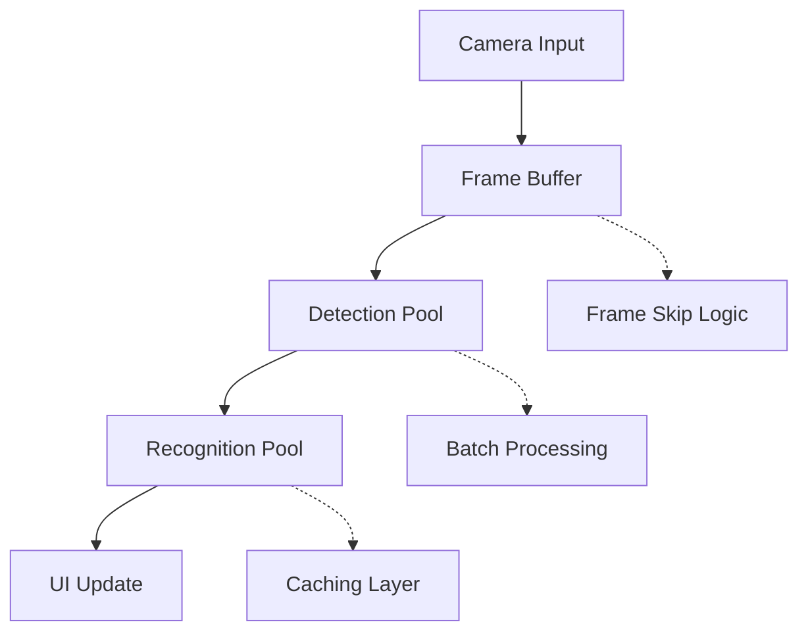
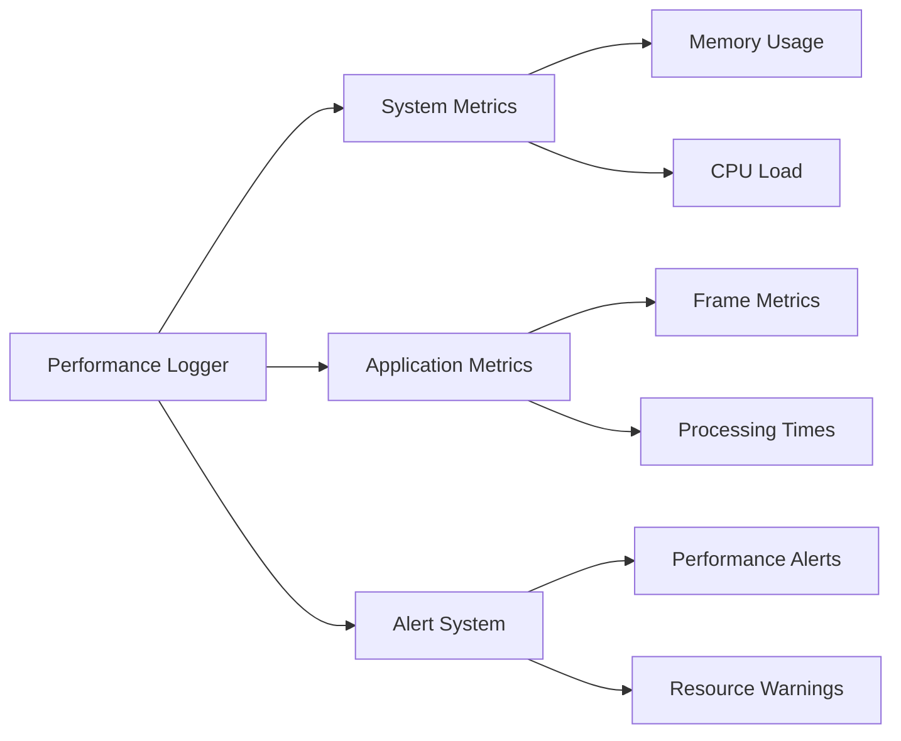

# Comprehensive Optimization Plan

## 1. Frame Processing Pipeline Optimization



### Hardware-Optimized Improvements:

1. **Smart Frame Buffering**
- Implement adaptive frame skipping based on CPU usage (target 70% max)
- Add frame quality assessment using AVX2/AVX512 optimized operations
- Buffer size tuned to L3 cache size (8MB) for optimal performance
- Utilize hardware-accelerated frame processing where available

2. **Enhanced Memory Utilization**
```python
class FaceDetectionPool:
    def __init__(self):
        # CPU optimization
        self.num_workers = 3  # Leave 1 core for UI/other tasks
        self.cpu_threshold = 0.7  # 70% CPU usage target
        
        # Memory optimization (32GB RAM available)
        self.frame_buffer_size = 1024  # Store more frames in memory
        self.batch_size = 16  # Larger batch processing
        self.frame_buffer = []
        self.embedding_cache_size = 10000  # Cache more face embeddings
        
        # Advanced memory features
        self.preload_models = True  # Keep models in RAM
        self.enable_frame_prefetch = True  # Prefetch next batch
        self.memory_pressure_threshold = 0.8  # 80% RAM usage
```

3. **Memory-Optimized Features**
- Large in-memory frame buffer (utilizing ~4GB for smooth processing)
- Extensive face embedding cache (up to 10,000 recent faces)
- Preloaded ML models in RAM
- Frame prefetching for smoother processing
- Memory pressure monitoring to prevent swapping

3. **Recognition Pool Optimizations**
- Implement result caching for recently seen faces
- Add confidence threshold to skip low-confidence recognitions
- Batch process similar faces together

## 2. Memory Management Improvements

### Current Issues:
- Potential memory leaks from frame copies
- Queue buildup during high load
- No memory pressure monitoring

### Solutions:
1. **Smart Resource Management**
- Implement memory pool for frame buffers
- Add automatic garbage collection triggers
- Monitor and limit queue sizes

2. **Frame Data Lifecycle**
```python
class FrameManager:
    def __init__(self):
        self.memory_pool = []
        self.max_queue_size = 30
        self.gc_threshold = 0.8  # 80% memory usage
```

## 3. Performance Monitoring Enhancements

### New Metrics to Track:
1. Memory usage per frame
2. Queue wait times
3. Frame drop rate
4. Cache hit rates



## 4. CPU-Optimized Threading Model

1. **Worker Pool Architecture**
- Primary detection pool: 3 worker threads on physical cores
- Recognition pool: 2 worker threads (sharing cores with detection)
- UI thread: Dedicated single core for responsiveness
- Background tasks: Utilize remaining logical cores

2. **Load Balancing and Thermal Management**
```python
class AdaptiveWorkerPool:
    def __init__(self):
        self.physical_cores = 4
        self.logical_cores = 8
        self.max_freq = 4200  # MHz
        self.min_freq = 400   # MHz
        self.thermal_threshold = 85  # Celsius
        
    def adjust_workers(self, load_factor, temp):
        if temp > self.thermal_threshold:
            return self.throttled_config()
            
        return min(
            3,  # Max workers for detection
            int(self.physical_cores * load_factor)
        )
        
    def optimize_thread_affinity(self):
        # Pin detection threads to physical cores 0-2
        # Pin UI thread to physical core 3
        # Let recognition threads float on logical cores
        pass
```

3. **CPU Feature Utilization**
- AVX512 optimization for matrix operations
- Hardware-accelerated video decode/encode
- SIMD instructions for parallel processing
- Enhanced frequency scaling based on workload

## 5. Caching Strategy

1. **Multi-level Cache**
- L1: In-memory face embedding cache
- L2: Persistent storage for frequent faces
- Implement LRU eviction policy

```python
class RecognitionCache:
    def __init__(self):
        self.l1_cache = LRUCache(100)  # Recent faces
        self.l2_cache = PersistentCache()
        self.hit_counter = Counter()
```

## 6. Implementation Priority

1. Frame buffer optimization (High Impact/Low Effort)
2. Caching implementation (High Impact/Medium Effort)
3. Memory management improvements (High Impact/High Effort)
4. Dynamic worker scaling (Medium Impact/Medium Effort)
5. Enhanced monitoring (Medium Impact/Low Effort)

## Hardware-Specific Requirements

1. Additional Dependencies:
```
- numpy>=1.21.0  # With AVX2/AVX512 optimizations
- opencv-python>=4.5  # With Intel optimizations
- psutil>=5.8.0
- scipy>=1.7.0
- intel-numpy  # For hardware-optimized operations
- python-memcached  # For distributed caching
- memory-profiler  # For detailed memory analysis
- pympler  # For memory leak detection
- xxhash  # Fast hashing for cache keys
- python-blosc  # For high-performance data compression
```

2. System Optimizations:
- Utilize all 4 physical cores (8 threads) efficiently
- Leverage AVX2/AVX512 instruction sets for vector operations
- Target L3 cache (8MB) for frame buffer sizing
- Exploit hardware-specific features:
  * Intel QuickSync for video processing
  * AVX512 for matrix operations
  * Turbo Boost management for sustained performance

## Hardware-Optimized Implementation Schedule

### Phase 1: Memory and CPU Optimization
1. Enable AVX512 support in NumPy/OpenCV
2. Implement SIMD-optimized frame processing
3. Configure large memory buffers:
   - 4GB frame buffer
   - 2GB face embedding cache
   - 1GB model preloading
4. Implement zero-copy frame processing
5. Set up memory pressure monitoring

### Phase 2: Frame Buffer Optimization
1. Create L3 cache-aware FrameBuffer class
2. Implement AVX2/512 accelerated quality assessment
3. Add hardware-aware dynamic buffer sizing
4. Integrate CPU load-based frame skipping
5. Benchmark and tune for optimal cache usage

### Phase 3: Thread Pool Architecture
1. Configure core-aware worker distribution
2. Implement thermal-aware thread scaling
3. Set up dedicated UI thread affinity
4. Add hardware-specific load balancing
5. Optimize thread synchronization

### Phase 4: Memory Management
1. Create cache-aligned memory pool
2. Implement hardware-aware GC triggers
3. Add CPU/memory monitoring
4. Optimize queue sizes for L2/L3 cache
5. Profile and tune memory access patterns

### Phase 5: Performance Monitoring
1. Add CPU-specific metrics:
   - Per-core utilization
   - Frequency scaling events
   - Thermal throttling detection
   - Cache hit/miss rates
2. Implement hardware event counters
3. Add Intel PMU metrics collection
4. Create CPU-aware alerting system
5. Set up hardware performance dashboards

## CPU-Specific Performance Metrics

### Hardware Utilization Tracking
1. **Core Usage Metrics**
   - Per-core load distribution
   - Frequency scaling behavior
   - Thermal throttling events
   - Thread migration patterns

2. **Cache Performance**
   - L2/L3 cache hit rates
   - Cache line utilization
   - Memory access patterns
   - Buffer overflow events

3. **SIMD Usage**
   - AVX2/512 instruction usage
   - Vector operation efficiency
   - SIMD saturation levels
   - Instruction pipeline stats

4. **Thermal Management**
   - Core temperature tracking
   - Frequency throttling events
   - Power consumption patterns
   - Cooling system response