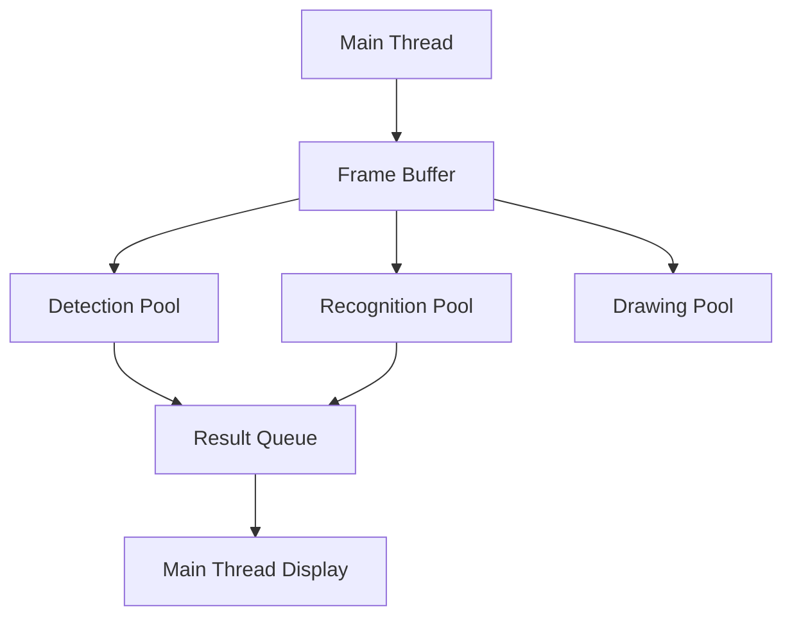

# Parallel Processing Architecture Guide

## Overview

This guide details the multi-threading architecture and parallel processing strategies implemented in the face recognition attendance system.



## Thread Pools

### 1. Face Detection Pool

```python
class FaceDetectionPool:
    """
    Manages parallel face detection processing
    """
    def __init__(self, num_workers: int = 6):
        self.num_workers = num_workers
        self.input_queue = Queue(maxsize=30)
        self.result_queue = Queue()
        self.workers = []
        self.active = True
        self.batch_size = 2
        
    def start(self):
        """Initialize and start worker threads"""
        for _ in range(self.num_workers):
            worker = Thread(target=self._detection_worker)
            worker.daemon = True
            worker.start()
            self.workers.append(worker)
            
    def _detection_worker(self):
        """Worker thread for face detection"""
        while self.active:
            # Batch processing
            frames = self._collect_batch()
            if frames:
                results = self._process_batch(frames)
                self._queue_results(results)
```

### 2. Recognition Pool

```python
class RecognitionPool:
    """
    Manages parallel face recognition processing
    """
    def __init__(self, num_workers: int = 4):
        self.num_workers = num_workers
        self.input_queue = Queue(maxsize=20)
        self.result_queue = Queue()
        self.face_database = FaceDatabase()
        
    def _recognition_worker(self):
        """Worker thread for face recognition"""
        while self.active:
            try:
                face_data = self.input_queue.get(timeout=0.1)
                result = self._process_recognition(face_data)
                self.result_queue.put(result)
            except Empty:
                continue
```

### 3. Drawing Pool

```python
class DrawingPool:
    """
    Manages parallel frame annotation and drawing
    """
    def __init__(self, num_workers: int = 2):
        self.num_workers = num_workers
        self.input_queue = Queue(maxsize=10)
        self.result_queue = Queue()
        
    def _drawing_worker(self):
        """Worker thread for frame annotation"""
        while self.active:
            try:
                frame_data = self.input_queue.get(timeout=0.1)
                annotated_frame = self._annotate_frame(frame_data)
                self.result_queue.put(annotated_frame)
            except Empty:
                continue
```

## Frame Buffer Management

### ThreadSafeFrameBuffer Implementation

```python
class ThreadSafeFrameBuffer:
    """
    Thread-safe frame buffer with memory pooling
    """
    def __init__(self, max_size: int = 30):
        self.max_size = max_size
        self._buffer = Queue(maxsize=max_size)
        self._frame_pool = []
        self._lock = Lock()
        
    def put_frame(self, frame: np.ndarray) -> bool:
        """Thread-safe frame insertion with memory pooling"""
        with self._lock:
            if self._buffer.full():
                self._handle_full_buffer()
            
            pooled_frame = self._get_pooled_frame(frame)
            return self._buffer.put(pooled_frame, block=False)
            
    def get_frame(self) -> Optional[np.ndarray]:
        """Thread-safe frame retrieval"""
        try:
            frame = self._buffer.get(block=False)
            self._return_to_pool(frame)
            return frame
        except Empty:
            return None
```

## Resource Management

### Memory Management

```python
class MemoryManager:
    """
    Manages memory allocation and pooling
    """
    def __init__(self):
        self.frame_pool = []
        self.max_pooled_frames = 50
        self._lock = Lock()
        
    def allocate_frame(self, shape):
        """Allocate frame from pool or create new"""
        with self._lock:
            if self.frame_pool:
                frame = self.frame_pool.pop()
                if frame.shape == shape:
                    return frame
            return np.empty(shape, dtype=np.uint8)
            
    def return_frame(self, frame):
        """Return frame to pool"""
        with self._lock:
            if len(self.frame_pool) < self.max_pooled_frames:
                self.frame_pool.append(frame)
```

### Thread Synchronization

```python
class ThreadCoordinator:
    """
    Coordinates thread pool activities
    """
    def __init__(self):
        self.pools = []
        self.active = True
        self._lock = Lock()
        self._condition = Condition(self._lock)
        
    def coordinate_processing(self):
        """Coordinate processing across thread pools"""
        with self._lock:
            while self.active:
                # Check pool status
                pool_status = self._check_pools()
                if self._should_adjust_workers(pool_status):
                    self._rebalance_workers()
                    
                # Wait for status change
                self._condition.wait(timeout=1.0)
```

## Performance Optimization

### 1. Batch Processing

```python
def process_batch(self, items):
    """Process items in batches for better performance"""
    results = []
    batch_size = self.batch_size
    
    # Process in batches
    for i in range(0, len(items), batch_size):
        batch = items[i:i + batch_size]
        batch_results = self._process_batch_items(batch)
        results.extend(batch_results)
    
    return results
```

### 2. Load Balancing

```python
class LoadBalancer:
    """
    Balances workload across thread pools
    """
    def __init__(self):
        self.pools = []
        self.metrics = {}
        
    def monitor_load(self):
        """Monitor and adjust thread pool loads"""
        while True:
            metrics = self._collect_metrics()
            if self._needs_rebalancing(metrics):
                self._rebalance_pools()
            time.sleep(5)
            
    def _rebalance_pools(self):
        """Rebalance workload across pools"""
        for pool in self.pools:
            current_load = self.metrics[pool.name]
            if current_load > 0.8:  # 80% threshold
                self._increase_workers(pool)
            elif current_load < 0.3:  # 30% threshold
                self._decrease_workers(pool)
```

### 3. Queue Management

```python
class QueueManager:
    """
    Manages queue sizes and thresholds
    """
    def __init__(self):
        self.queues = {}
        self.thresholds = {}
        
    def monitor_queues(self):
        """Monitor queue sizes and adjust as needed"""
        while True:
            for queue_name, queue in self.queues.items():
                size = queue.qsize()
                threshold = self.thresholds[queue_name]
                
                if size > threshold:
                    self._handle_queue_overflow(queue_name)
            time.sleep(1)
```

## Error Handling

### 1. Thread Error Recovery

```python
def handle_thread_error(self, thread_id, error):
    """Handle thread errors and recovery"""
    try:
        # Log error
        logger.error(f"Thread {thread_id} error: {error}")
        
        # Attempt recovery
        if self._can_recover(error):
            self._restart_thread(thread_id)
        else:
            self._shutdown_gracefully()
    except Exception as e:
        logger.critical(f"Recovery failed: {e}")
        raise
```

### 2. Queue Error Handling

```python
def handle_queue_error(self, queue_name, error):
    """Handle queue-related errors"""
    try:
        # Clear problematic queue
        self._clear_queue(queue_name)
        
        # Reset associated threads
        self._reset_threads(queue_name)
        
        # Restart processing
        self._resume_processing(queue_name)
    except Exception as e:
        logger.error(f"Queue error recovery failed: {e}")
        raise
```

## Monitoring and Diagnostics

### Performance Metrics Collection

```python
class PerformanceMonitor:
    """
    Monitors thread pool performance
    """
    def __init__(self):
        self.metrics = {}
        self.start_time = time.time()
        
    def collect_metrics(self):
        """Collect performance metrics"""
        metrics = {
            'queue_sizes': self._get_queue_sizes(),
            'processing_times': self._get_processing_times(),
            'thread_utilization': self._get_thread_utilization(),
            'memory_usage': self._get_memory_usage()
        }
        self.metrics = metrics
        return metrics
```

## Best Practices

1. **Thread Pool Management**
   - Keep pool sizes appropriate for CPU cores
   - Monitor thread health
   - Implement proper shutdown procedures

2. **Queue Management**
   - Set appropriate queue sizes
   - Implement overflow handling
   - Monitor queue performance

3. **Resource Management**
   - Implement memory pooling
   - Monitor resource usage
   - Handle resource cleanup

4. **Error Handling**
   - Implement thread recovery
   - Handle queue errors
   - Maintain system stability