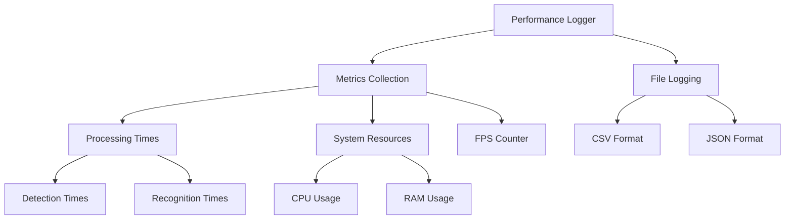

# Performance Logging System Plan

## Overview
This document outlines the plan for implementing a comprehensive performance logging system for the face recognition application. The system will track processing times, system resource usage, and overall performance metrics.

## Architecture



## Components

### 1. PerformanceLogger Class
Location: `src/utils/performance_logger.py`

Key features:
- Singleton design pattern for global access
- Thread-safe metric collection
- Configurable logging intervals
- Automatic log rotation
- Resource-efficient monitoring

### 2. Directory Structure
```
logs/
  ├── performance/
  │   ├── YYYY-MM-DD/
  │   │   ├── system_metrics.csv    # CPU, RAM usage
  │   │   ├── processing_times.csv  # Detection, recognition times
  │   │   └── fps_log.csv          # FPS measurements
  │   └── latest/  # Symlink to current day
```

### 3. Metrics Collection

#### Processing Times
- Face detection times per frame
- Face recognition times per face
- Frame processing pipeline times

#### System Resources
- CPU usage (overall and per-core)
- RAM usage (total, available, used)
- Process-specific resource usage

#### Performance Metrics
- Frames per second (FPS)
- Detection success rate
- Recognition confidence scores

### 4. Implementation Phases

#### Phase 1: Core Infrastructure
- Create PerformanceLogger class
- Set up logging directory structure
- Implement basic metric collection
- Add configuration options

#### Phase 2: Metric Collection Integration
- Hook into detection_pool.py
- Hook into recognition_pool.py
- Add system resource monitoring
- Implement FPS tracking

#### Phase 3: Log Management
- Implement log rotation
- Add log compression
- Set up log cleanup policies
- Create latest symlink

#### Phase 4: Optional Enhancements
- Real-time performance visualization
- Performance alerts
- Metric aggregation and analysis tools

## Integration Points

### Detection Pool Integration
```python
# In detection_pool.py
from ..utils.performance_logger import PerformanceLogger

class DetectionResult:
    def __init__(self, faces, frame_id, processing_time):
        PerformanceLogger.instance().log_detection_time(processing_time)
```

### Recognition Pool Integration
```python
# In recognition_pool.py
from ..utils.performance_logger import PerformanceLogger

class RecognitionResult:
    def __init__(self, face_id, frame_id, ..., processing_time):
        PerformanceLogger.instance().log_recognition_time(processing_time)
```

## Technical Requirements

### Dependencies
- psutil: System resource monitoring
- pandas: Data manipulation and CSV handling
- numpy: Numerical computations
- pathlib: Path manipulation

### Performance Considerations
- Minimal impact on main application performance
- Efficient file I/O operations
- Thread-safe metric collection
- Memory-efficient logging

## Configuration Options
- Logging interval
- Metrics to collect
- Log rotation policy
- File format preferences
- Performance alert thresholds

## Next Steps
1. Switch to code mode to begin implementation
2. Start with Phase 1 core infrastructure
3. Integrate with existing detection and recognition pools
4. Add system resource monitoring
5. Implement log management
6. Test and optimize