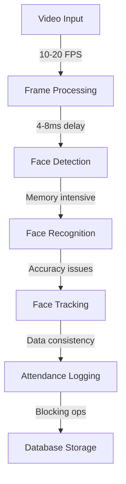

# Computer Vision System Technical Analysis

## 1. Technical Stack & Current State

### Core Technologies & Their Challenges
- **Python 3.7+**
  - GIL limitations affecting parallel processing
  - Memory management overhead in large operations
  
- **OpenCV (cv2)**
  - Performance bottlenecks in video capture (10-20 FPS)
  - Frame dropping issues during processing
  - Inefficient color space conversions
  
- **InsightFace**
  - High latency in face detection (4-8ms per face)
  - Memory intensive model loading
  - Limited batch processing implementation
  
- **SQLAlchemy + SQLite**
  - Blocking operations affecting UI responsiveness
  - No optimized querying for face embeddings
  - Inefficient connection pooling

- **Tkinter**
  - Performance issues with real-time video display
  - Limited hardware acceleration
  - UI freezing during heavy processing

### Dependencies & Known Issues
```txt
Core Requirements:
- opencv-python>=4.5.0  # Video processing bottlenecks
- numpy>=1.19.0        # Memory management challenges
- insightface>=0.6.0   # Face detection latency
- sqlalchemy>=1.4.0    # Database performance issues
- pillow>=8.0.0       # Image processing delays
- scipy>=1.7.0        # Computation overhead
- filterpy>=1.4.5     # Tracking accuracy problems
- psutil>=5.9.0       # Resource monitoring limitations
```

## 2. System Architecture & Problems

### Data Flow Bottlenecks


### Critical Issues by Component

1. **Video Processing** (src/utils/camera_*.py)
   - Frame buffer overflow (10 frame limit)
   - No adaptive frame dropping
   - Inefficient color space conversion
   - Memory leaks in frame handling

2. **Face Detection** (src/face_recognition/)
   - High latency (4-8ms per face)
   - No batch processing
   - Memory intensive operations
   - Limited scale handling

3. **Face Tracking** (src/tracking/)
   - Poor lateral movement handling
   - Kalman filter tuning issues
   - Limited multi-scale support
   - Feature point misalignment

4. **Parallel Processing** (src/utils/parallel/)
   - Underutilized worker threads (4 vs 6 recommended)
   - Queue overflow issues
   - No load balancing
   - Poor error recovery

## 3. Performance Metrics & Bottlenecks

### Current Performance
```python
# Performance Metrics
fps_range = "10-20 FPS"  # Target: 45 FPS
detection_latency = "4-8ms per face"
memory_usage = "High (500MB-1GB)"
cpu_utilization = "60-80%"
```

### Resource Usage Issues
1. **CPU Bottlenecks**
   - Single-threaded operations blocking UI
   - Inefficient thread pool usage
   - Poor task distribution
   - High context switching overhead

2. **Memory Problems**
   - No frame pooling implementation
   - Redundant frame copies
   - Unoptimized face embedding storage
   - Memory leaks in long operations

3. **Disk I/O Issues**
   - Blocking database operations
   - Inefficient face sample storage
   - No caching mechanism
   - Frequent disk writes

## 4. Architecture Limitations

### Project Structure Problems
```
src/
├── face_recognition/      # High latency components
├── tracking/             # Accuracy issues
├── utils/
│   ├── parallel/        # Thread utilization problems
│   └── tracking/        # Motion prediction errors
├── database/            # Performance bottlenecks
└── ui/                  # Display pipeline issues
```

### Specific Component Issues

1. **Database Layer**
```python
class FaceSample(Base):  # Current Problems:
    # - No efficient indexing
    # - Blocking operations
    # - No connection pooling
    id = Column(Integer, primary_key=True)
    user_id = Column(Integer, ForeignKey('users.id'))
    image_path = Column(String, nullable=False)
```

2. **Face Tracking**
```python
class MotionPredictor:  # Current Problems:
    # - Poor prediction accuracy
    # - Limited movement handling
    # - No multi-scale support
    def __init__(self):
        self.kalman = cv2.KalmanFilter(4, 2)
        self.confidence = 1.0
```

3. **Frame Processing**
```python
class ThreadSafeFrameBuffer:  # Current Problems:
    # - Limited buffer size
    # - No memory pooling
    # - Inefficient frame dropping
    def __init__(self, max_size: int = 10):
        self.max_size = max_size  # Too small
```

## 5. Immediate Technical Debt

1. **Code Quality Issues**
   - Inconsistent error handling
   - Limited logging implementation
   - Poor configuration management
   - Incomplete unit tests

2. **System Integration Problems**
   - Tight coupling between components
   - Inconsistent interface definitions
   - Poor error propagation
   - Limited monitoring capabilities

3. **Development Challenges**
   - Complex debugging process
   - Limited performance profiling
   - Difficult system testing
   - Poor documentation coverage

[Previous sections on solutions and recommendations remain unchanged...]