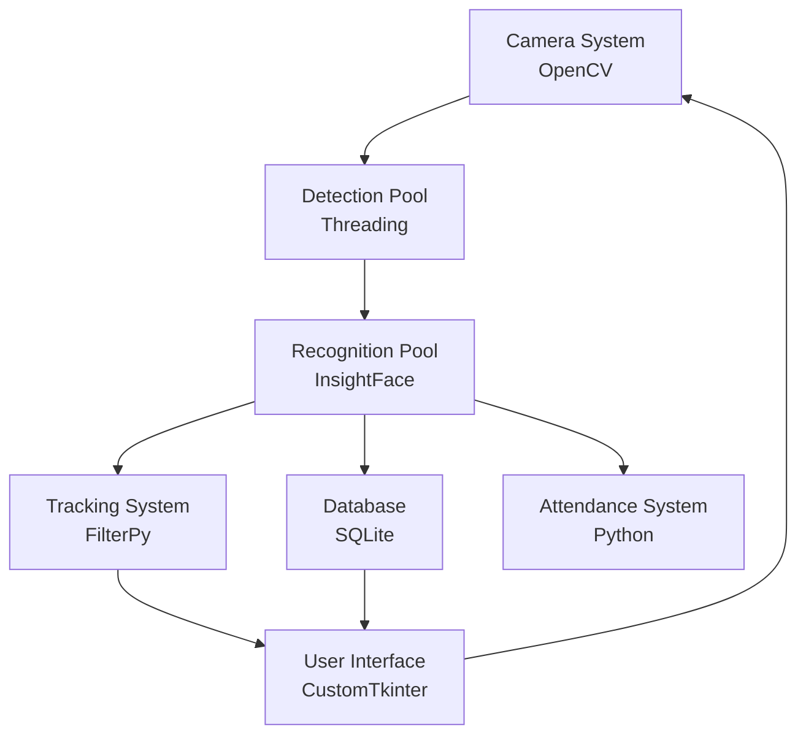

# Face Recognition System - Technical Architecture

## System Overview

This document explains the technical architecture of the face recognition system through its folder structure, highlighting how different components interact and the technologies used.

## Core System Architecture (`src/`)

### Face Recognition & Tracking Core
- `src/face_recognition/`
  - Core recognition algorithms and initializers
  - Technologies:
    * OpenCV (cv2) for image processing
    * NumPy for numerical operations
    * InsightFace for face recognition models
- `src/tracking/`
  - Real-time tracking algorithms
  - Technologies:
    * FilterPy for tracking algorithms
    * NumPy for numerical computations

### Parallel Processing System (`src/utils/parallel/`)
- Technologies:
  * Python threading for concurrent operations
  * Queue for thread-safe data transfer
Components:
- `detection_pool.py`: Manages parallel face detection operations
- `recognition_pool.py`: Handles concurrent face recognition tasks
- `frame_buffer.py`: Thread-safe frame data coordination
- `drawing_pool.py`: Parallel UI rendering

### Camera System (`src/utils/`)
- Technologies:
  * OpenCV for camera interfaces
  * psutil for system resource monitoring
Components:
- Multiple camera source implementations:
  - `local_camera.py`: Local webcam integration
  - `ip_camera.py`: Network camera support
  - `mobile_camera.py`: Mobile device camera integration
- `camera_manager.py`: Unified camera management interface
- `distance_tracking.py`: Subject distance calculation
- `position_tracking.py`: Physical position tracking

### Database Layer (`src/database/`)
- Technologies:
  * SQLite for data storage
  * Python's built-in sqlite3 module
Components:
- Core database operations and models
- Soft delete functionality
- Migration system for schema updates

### User Interface (`src/ui/`)
- Technologies:
  * CustomTkinter for modern UI components
  * CTkMessagebox for dialogs
Components:
- Main application window and camera view
- Component-based architecture:
  - `components/camera_view.py`: Real-time video display
  - `components/control_panel.py`: System controls
  - `components/dialogs.py`: User interaction dialogs
- Theme management and UI customization

### Attendance System (`src/attendance/`)
- Technologies:
  * SQLite for record storage
  * Python's datetime for timestamp management
Components:
- Integrates face recognition with attendance tracking
- Logging system for attendance records
- Database integration for record persistence

## Support Systems

### Testing Framework (`tests/`)
- Technologies:
  * pytest for unit testing
Components:
- Unit tests for core components
- UI testing suite
- Performance testing tools

### Diagnostic Tools (`tools/`)
- Technologies:
  * OpenCV for camera diagnostics
  * psutil for system monitoring
Components:
- `diagnose_camera.py`: Camera system diagnostics
- `diagnose_ip_camera.py`: Network camera troubleshooting

### Data Management
- `face_data/`: Stores face recognition models and data
- `attendance_records/`: Maintains attendance logs
- `faces/`: Manages face image storage

## Component Interactions

## Configuration and Setup
- `config/`: System-wide configuration
- `requirements.txt`: Python dependencies
- `install.sh`: Installation script
- `setup.py`: Package configuration

## Documentation Structure
- `documentation/en/`: English technical documentation
- `documentation/latex/`: Detailed technical specifications

## Performance Optimization
The system utilizes parallel processing pools for:
- Face detection
- Face recognition
- Frame processing
- UI rendering

Technologies used for optimization:
- Python's threading module for parallel processing
- NumPy for efficient numerical operations
- OpenCV for optimized image processing
- Queue for thread-safe data transfer

This architecture ensures optimal performance while maintaining real-time processing capabilities through efficient use of system resources and parallel processing.