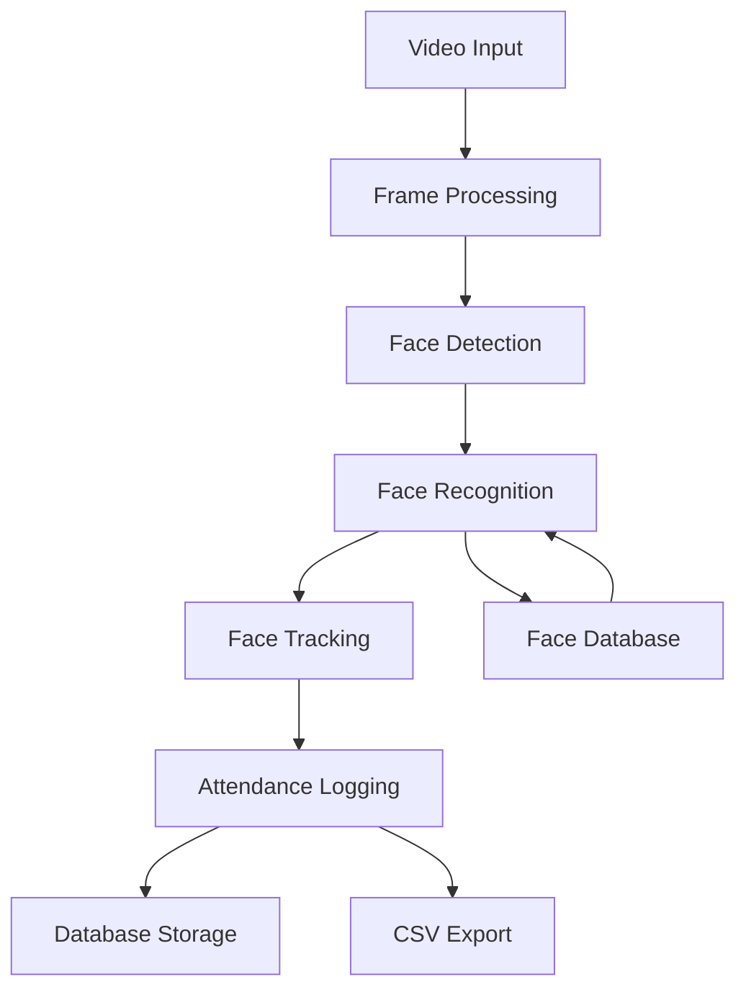

# Face Recognition Attendance System - Technical Overview

## 1. System Architecture



## 2. Core Technology Stack

### Programming Foundation
- Python 3.7+ as primary language
- Leverages Python's rich ecosystem for AI/ML/CV

### Key Components
1. **Computer Vision & AI**
   - OpenCV (cv2) for video processing
   - InsightFace for face detection/recognition
   - Custom tracking system implementation

2. **User Interface**
   - Tkinter-based desktop interface
   - Real-time video display
   - Custom dialog implementations

3. **Data Management**
   - SQLAlchemy ORM
   - SQLite database
   - CSV for attendance logs
   - Pickle for face embedding storage

## 3. Implementation Details

### Face Recognition Pipeline
1. **Video Capture**
   - webcam view quality
   - 30 FPS target
   - Configurable frame buffer

2. **Processing Workflow**
   - Frame preprocessing
   - Face detection using InsightFace
   - Face recognition with embedding comparison
   - Real-time tracking system

### Performance Features
1. **Parallel Processing**
   - Multi-threaded video processing
   - Thread-safe frame buffer
   - Worker pools for detection/recognition

2. **Optimizations**
   - Frame scaling
   - Memory management
   - Database connection pooling

## 4. Technical Challenges & Solutions

### Current Challenges
1. **Performance Bottlenecks**
   - GIL limitations
   - Video processing speed (10-20 FPS)
   - Face detection latency (40-60ms per face)

2. **Resource Usage**
   - Memory intensive operations
   - CPU utilization issues
   - Storage efficiency concerns

### Implemented Solutions
1. **Processing Optimizations**
   - Adaptive frame dropping
   - Efficient color space conversions
   - Batch processing implementation

2. **System Improvements**
   - Enhanced error handling
   - Performance monitoring
   - Improved testing coverage

## 5. Project Structure

```
src/
├── face_recognition/    # Core recognition logic
├── tracking/           # Motion tracking
├── utils/
│   ├── parallel/      # Threading components
│   └── tracking/      # Motion prediction
├── database/          # Data persistence
└── ui/                # User interface