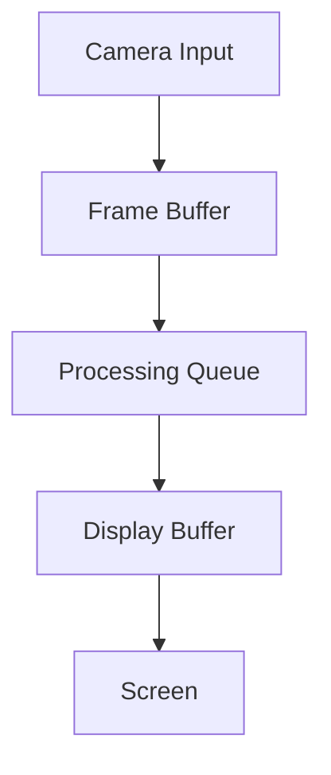

# Drawing Display Flickering Fix Plan

## Current Issues

### 1. Frame Processing Pipeline
- Asynchronous frame processing without proper synchronization
- No coordination between frame capture, processing, and display
- Lack of frame buffering mechanism

### 2. UI Update Issues
- Direct frame updates without considering tkinter's event loop timing
- Missing double buffering in UI layer
- Inefficient PhotoImage creation per frame

### 3. Drawing Operations
- Multiple independent drawing operations per frame
- No batching of draw operations
- Potential race conditions in multi-threaded drawing

## Proposed Solutions

### 1. Frame Buffer Implementation

- Add circular frame buffer to store processed frames
- Implement producer-consumer pattern for frame processing
- Add frame synchronization mechanism

### 2. UI Display Improvements
- Implement double buffering for smooth display
- Synchronize frame updates with display refresh rate
- Optimize PhotoImage creation and caching
- Add vsync support for tear-free display

### 3. Drawing Optimization
- Batch drawing operations into single frame update
- Utilize hardware acceleration where available
- Implement intelligent frame skipping under heavy load

## Implementation Steps

1. **Frame Buffer System**
   - Create CircularFrameBuffer class
   - Implement thread-safe frame queue
   - Add frame synchronization mechanisms

2. **UI Layer Updates**
   - Add double buffering to CameraView
   - Implement display sync mechanism
   - Optimize image conversion pipeline

3. **Drawing Optimizations**
   - Batch drawing operations
   - Add hardware acceleration support
   - Implement adaptive frame skipping

4. **Testing & Validation**
   - Measure frame timing and consistency
   - Validate smooth display across different loads
   - Performance testing under various conditions

## Expected Outcomes

- Consistent, flicker-free display
- Improved drawing performance
- Reduced CPU/GPU usage
- Better frame timing consistency