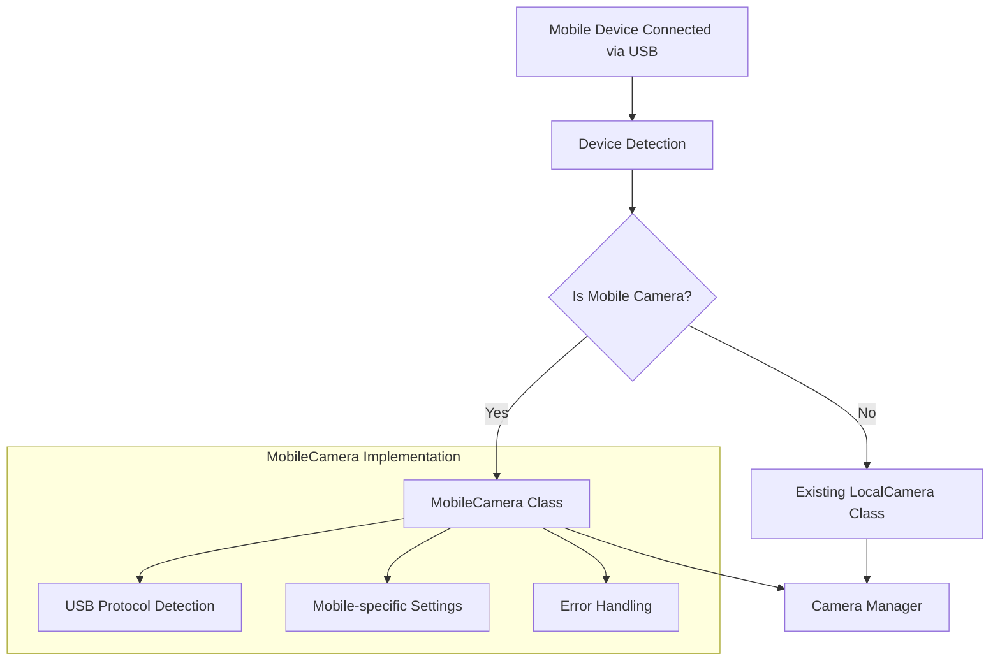

# Mobile Camera Integration Plan

## Overview
This document outlines the plan for integrating mobile device cameras via USB cable connection into the existing camera system.

## System Architecture



## Implementation Components

### 1. MobileCamera Class
- Inherit from CameraSource base class
- Handle mobile-specific initialization
- Implement device detection and configuration
- Handle connection state management
- Provide fallback mechanisms for disconnections

### 2. Camera Manager Updates
- Add mobile camera detection capabilities
- Create factory method for mobile camera instantiation
- Handle mobile-specific connection states and errors
- Provide seamless integration with existing camera types

### 3. Device Detection System
- Implement USB device detection
- Identify mobile camera capabilities
- Handle different mobile protocols (UVC, etc.)
- Manage device enumeration and selection

### 4. Configuration Updates
```python
MOBILE_CAMERA_CONFIG = {
    'default': {
        'width': 1280,
        'height': 720,
        'fps': 30,
        'buffer_size': 1,
        'reconnect_timeout': 5,
        'device_protocols': ['UVC']
    },
    'fallback': {
        'width': 640,
        'height': 480,
        'fps': 15
    }
}
```

## Technical Requirements

1. USB Device Support:
   - UVC (USB Video Class) protocol support
   - Mobile device detection and identification
   - Multiple device handling

2. Error Handling:
   - Device disconnection recovery
   - Protocol negotiation failures
   - Resource cleanup on disconnect

3. Performance Considerations:
   - Buffer management for USB video stream
   - Frame rate optimization
   - Resource usage monitoring

## Implementation Steps

1. Device Detection Layer:
   - Create USB device enumeration system
   - Implement protocol detection
   - Add device capability querying

2. MobileCamera Class Implementation:
   - Create base class structure
   - Implement device initialization
   - Add mobile-specific configuration
   - Handle connection management

3. Camera Manager Integration:
   - Add mobile camera factory method
   - Update device management system
   - Implement new connection handling

4. Testing and Validation:
   - Unit tests for new components
   - Integration testing with different devices
   - Performance benchmarking
   - Error recovery testing

## Usage Example

```python
# Creating a mobile camera instance
mobile_cam = CameraManager.create_mobile_camera(device_id="/dev/video2")

# Adding to camera manager
camera_manager.add_camera("mobile_cam_1", mobile_cam)

# Reading frames
frames = camera_manager.get_frame("mobile_cam_1")
```

## Future Enhancements

1. Wireless Mobile Camera Support
2. Multiple Mobile Camera Management
3. Advanced Mobile Camera Controls
4. Auto-reconnection Features