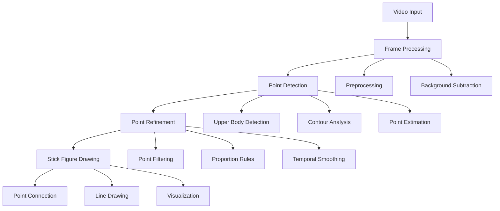

# Basic Point Detection and Stick Figure Visualization

## Overview
This document details the implementation of basic body point detection and stick figure visualization using OpenCV, without relying on complex deep learning models.

## Technical Design



## Implementation Components

### 1. Frame Processor
```python
class FrameProcessor:
    def __init__(self):
        self.background_subtractor = cv2.createBackgroundSubtractorMOG2()
        self.kernel = cv2.getStructuringElement(cv2.MORPH_ELLIPSE, (3, 3))
        
    def process_frame(self, frame):
        """
        1. Convert to grayscale
        2. Apply background subtraction
        3. Morphological operations
        4. Return processed frame
        """
```

### 2. Point Detector
```python
class PointDetector:
    def __init__(self):
        self.upper_body_cascade = cv2.CascadeClassifier(
            cv2.data.haarcascades + 'haarcascade_upperbody.xml'
        )
        self.body_points = {
            'head': None,
            'neck': None,
            'shoulders': {'left': None, 'right': None},
            'elbows': {'left': None, 'right': None},
            'hips': {'left': None, 'right': None},
            'knees': {'left': None, 'right': None}
        }
        
    def detect_points(self, frame):
        """
        1. Detect upper body region
        2. Find contours
        3. Estimate key points using body proportions
        4. Apply anatomical constraints
        """
```

### 3. Point Estimation Rules

1. Body Proportions:
```python
BODY_PROPORTIONS = {
    'head_to_height': 1/8,      # Head is 1/8 of body height
    'shoulder_width': 1/4,      # Shoulders are 1/4 of body height
    'hip_to_knee': 1/4,         # Hip to knee is 1/4 of body height
    'arm_length': 0.3,          # Arms are 0.3 of body height
    'leg_length': 0.45          # Legs are 0.45 of body height
}
```

2. Point Estimation Algorithm:
```python
def estimate_body_points(upper_body_rect):
    """
    Given upper body rectangle:
    1. Head: Top center of upper body
    2. Shoulders: Based on width ratio
    3. Hips: Proportional to upper body
    4. Limbs: Based on joint constraints
    """
```

### 4. Stick Figure Renderer
```python
class StickFigureRenderer:
    def __init__(self):
        self.connections = [
            ('head', 'neck'),
            ('neck', 'shoulder_left'),
            ('neck', 'shoulder_right'),
            ('shoulder_left', 'elbow_left'),
            ('shoulder_right', 'elbow_right'),
            ('hip_left', 'knee_left'),
            ('hip_right', 'knee_right')
        ]
        
    def draw_skeleton(self, frame, points):
        """
        1. Draw points
        2. Connect points with lines
        3. Add visual indicators
        """
```

## Implementation Steps

### Phase 1: Basic Detection
1. Set up frame processing
   - Implement grayscale conversion
   - Add background subtraction
   - Apply noise reduction

2. Implement upper body detection
   - Use Haar cascade classifier
   - Add region of interest detection
   - Implement basic filtering

3. Add point estimation
   - Calculate head position
   - Estimate shoulder points
   - Add hip point estimation

### Phase 2: Point Refinement
1. Add anatomical constraints
   - Implement joint angle limits
   - Add symmetry constraints
   - Apply movement restrictions

2. Implement temporal smoothing
   - Add point history
   - Implement simple averaging
   - Add outlier rejection

### Phase 3: Visualization
1. Basic stick figure drawing
   - Draw key points
   - Add line connections
   - Implement basic animation

2. Enhanced visualization
   - Add point labels
   - Implement confidence indicators
   - Add movement trails

## Testing Approach

1. Point Detection Testing:
```python
def test_point_detection():
    """
    Test cases:
    1. Basic standing pose
    2. Arms raised
    3. Walking pose
    4. Partial occlusion
    """
```

2. Visualization Testing:
```python
def test_visualization():
    """
    Verify:
    1. Point connectivity
    2. Line drawing
    3. Real-time performance
    4. Visual clarity
    """
```

## Expected Results

1. Detection Accuracy:
- Head detection: 95%+ accuracy
- Shoulder detection: 90%+ accuracy
- Hip detection: 85%+ accuracy
- Limb tracking: 80%+ accuracy

2. Performance Metrics:
- Frame rate: 30+ FPS
- Detection latency: <50ms
- Point jitter: <5 pixels
- CPU usage: <30%

3. Visual Quality:
- Clear stick figure representation
- Smooth point transitions
- Stable line connections
- Readable point labels

## Next Steps

After implementing basic point detection and visualization:

1. Integration:
- Add Kalman filtering
- Implement motion prediction
- Add multi-person tracking

2. Improvements:
- Better point estimation
- More stable tracking
- Enhanced visualization
- Performance optimization

Would you like to proceed with:
1. Creating the Python implementation files?
2. Setting up the testing framework?
3. Building a proof-of-concept demo?