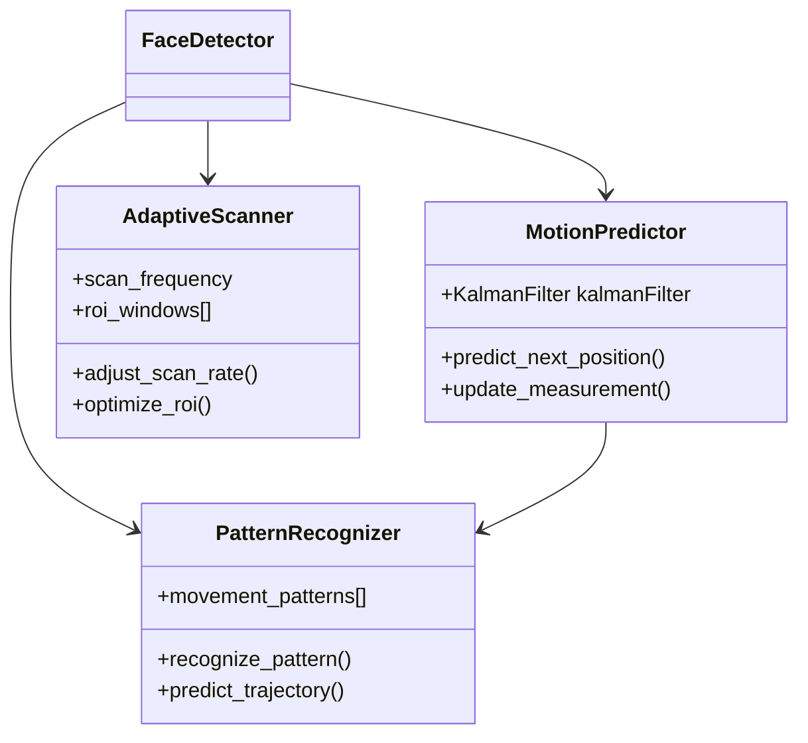

# Face Tracking Optimization Plan

## Overview
This document outlines the plan to optimize face tracking by implementing predictive tracking and reducing unnecessary scanning operations.

## 1. Enhanced Prediction System

### Kalman Filter Implementation
- Add Kalman filtering to predict face positions
  - Track position, velocity, and acceleration vectors
  - Implement state prediction between frames
  - Update measurements when new detections occur
  - Handle uncertainty in predictions and measurements

### Motion Vector Analysis
- Track movement direction and speed
  - Calculate motion vectors between consecutive frames
  - Store historical motion data
  - Analyze acceleration patterns
  - Use motion history for improved predictions

## 2. Adaptive Scanning

### Dynamic Scan Frequency
- Implement variable scanning rates
  - Reduce frequency when faces move slowly/predictably
  - Increase frequency during rapid/unpredictable movement
  - Skip frames when prediction confidence is high
  - Maintain minimum scan rate for reliability

### Region of Interest (ROI) Optimization
- Focus detection on predicted areas
  - Create dynamic ROI windows based on predictions
  - Adjust window size based on velocity
  - Expand search area when confidence decreases
  - Fall back to full frame scan if tracking lost

## 3. Pattern Recognition

### Movement Pattern Analysis
- Implement pattern recognition system
  - Store common movement trajectories
  - Classify movement patterns
  - Learn from historical data
  - Weight predictions based on pattern confidence

### Position History Enhancement
- Improve position tracking
  - Store complete movement paths
  - Analyze common trajectories
  - Detect and store recurring patterns
  - Use pattern matching for prediction

## 4. Technical Implementation

### New Classes

```python
class MotionPredictor:
    """Handles motion prediction using Kalman filtering"""
    - KalmanFilter state
    - Motion history
    - Prediction confidence metrics
    - Methods for state prediction and update

class PatternRecognizer:
    """Analyzes and recognizes movement patterns"""
    - Pattern database
    - Pattern matching algorithms
    - Learning capabilities
    - Trajectory prediction

class AdaptiveScanner:
    """Manages dynamic scanning behavior"""
    - Scan rate controller
    - ROI management
    - Performance metrics
    - Adaptive parameters
```

### Integration Plan



## 5. Expected Benefits

- Reduced CPU usage through intelligent scanning
- More stable tracking through prediction
- Better handling of rapid movements
- Improved accuracy in position estimation
- Lower latency in tracking response

## 6. Implementation Phases

1. Phase 1: Kalman Filter Integration
   - Implement basic state prediction
   - Add measurement updates
   - Test prediction accuracy

2. Phase 2: Adaptive Scanning
   - Implement variable scan rates
   - Add ROI optimization
   - Test performance impact

3. Phase 3: Pattern Recognition
   - Add pattern storage
   - Implement pattern matching
   - Test prediction improvements

4. Phase 4: Integration & Optimization
   - Combine all components
   - Fine-tune parameters
   - Performance testing