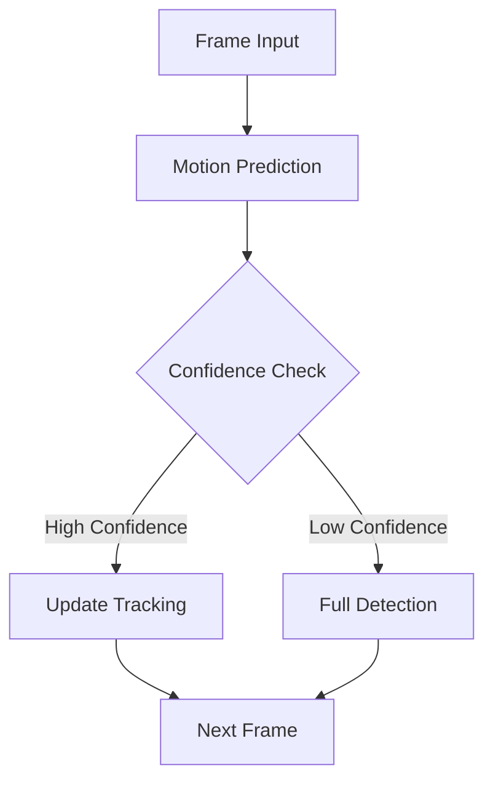

# Face Tracking and Motion Prediction System

## Overview

The tracking system optimizes face detection by predicting face locations between frames, reducing the need for full frame detection on every frame.



## Motion Predictor Implementation

```python
class MotionPredictor:
    """
    Predicts face motion between frames using Kalman filtering
    """
    def __init__(self):
        self.kalman = cv2.KalmanFilter(4, 2)  # State: x, y, dx, dy
        self.initialize_kalman()
        self.last_position = None
        self.confidence = 1.0
        
    def initialize_kalman(self):
        """Initialize Kalman filter parameters"""
        self.kalman.measurementMatrix = np.array([
            [1, 0, 0, 0],
            [0, 1, 0, 0]], np.float32)
        
        self.kalman.transitionMatrix = np.array([
            [1, 0, 1, 0],
            [0, 1, 0, 1],
            [0, 0, 1, 0],
            [0, 0, 0, 1]], np.float32)
        
        self.kalman.processNoiseCov = np.array([
            [1e-4, 0, 0, 0],
            [0, 1e-4, 0, 0],
            [0, 0, 1e-4, 0],
            [0, 0, 0, 1e-4]], np.float32) * 0.03
```

## Face Tracking System

### Tracker Implementation

```python
class FaceTracker:
    """
    Manages face tracking across video frames
    """
    def __init__(self):
        self.trackers = {}  # id -> tracker mapping
        self.motion_predictors = {}  # id -> predictor mapping
        self.max_tracking_age = 30  # frames
        
    def update(self, frame, detections):
        """Update trackers with new frame and detections"""
        # Update existing trackers
        self._update_trackers(frame)
        
        # Associate detections with trackers
        self._associate_detections(detections)
        
        # Update motion predictions
        self._update_predictions()
        
        # Remove stale trackers
        self._cleanup_trackers()
```

### Detection Association

```python
def _associate_detections(self, detections):
    """
    Associate new detections with existing trackers
    using IoU (Intersection over Union) matching
    """
    if not detections:
        return
        
    # Calculate IoU matrix
    iou_matrix = np.zeros((len(self.trackers), len(detections)))
    for t, tracker in enumerate(self.trackers.values()):
        for d, detection in enumerate(detections):
            iou_matrix[t, d] = self._calculate_iou(
                tracker.get_position(),
                detection
            )
            
    # Use Hungarian algorithm for optimal assignment
    matched_indices = linear_assignment(-iou_matrix)
    
    # Update trackers with matched detections
    for tracker_idx, detection_idx in matched_indices:
        if iou_matrix[tracker_idx, detection_idx] >= self.iou_threshold:
            self._update_tracker_with_detection(
                list(self.trackers.keys())[tracker_idx],
                detections[detection_idx]
            )
```

### Motion Prediction

```python
def predict_next_position(self, tracker_id):
    """
    Predict next face position using motion predictor
    """
    if tracker_id not in self.motion_predictors:
        return None
        
    predictor = self.motion_predictors[tracker_id]
    prediction = predictor.predict()
    
    # Update confidence based on prediction error
    if predictor.last_position is not None:
        error = self._calculate_prediction_error(
            prediction,
            predictor.last_position
        )
        predictor.confidence *= (1 - min(error, 0.5))
    
    return prediction, predictor.confidence
```

## Optimization Strategies

### 1. Selective Detection

```python
def should_run_detection(self, tracker_id):
    """
    Determine if full detection is needed based on tracking confidence
    """
    if tracker_id not in self.motion_predictors:
        return True
        
    predictor = self.motion_predictors[tracker_id]
    
    # Run detection if confidence is low
    if predictor.confidence < 0.6:
        return True
        
    # Run detection periodically even with high confidence
    if self.frame_count % 30 == 0:
        return True
        
    return False
```

### 2. Multi-Scale Tracking

```python
class MultiScaleTracker:
    """
    Implements multi-scale tracking for improved accuracy
    """
    def __init__(self):
        self.scales = [0.5, 1.0, 2.0]
        self.current_scale = 1.0
        
    def update(self, frame, bbox):
        """Update tracking at multiple scales"""
        best_response = float('-inf')
        best_bbox = None
        
        for scale in self.scales:
            scaled_frame = cv2.resize(
                frame, 
                None, 
                fx=scale, 
                fy=scale
            )
            scaled_bbox = self._scale_bbox(bbox, scale)
            
            response = self._compute_tracking_response(
                scaled_frame,
                scaled_bbox
            )
            
            if response > best_response:
                best_response = response
                best_bbox = self._scale_bbox(
                    scaled_bbox,
                    1/scale
                )
                
        return best_bbox
```

### 3. Adaptive Tracking

```python
class AdaptiveTracker:
    """
    Adapts tracking parameters based on scene conditions
    """
    def __init__(self):
        self.motion_threshold = 0.1
        self.blur_threshold = 50
        self.lighting_threshold = 100
        
    def adapt_parameters(self, frame):
        """Adapt tracking parameters based on frame analysis"""
        motion = self._estimate_motion(frame)
        blur = self._estimate_blur(frame)
        lighting = self._estimate_lighting(frame)
        
        # Adjust tracking parameters
        if motion > self.motion_threshold:
            self._adjust_for_motion()
        
        if blur > self.blur_threshold:
            self._adjust_for_blur()
            
        if lighting < self.lighting_threshold:
            self._adjust_for_low_light()
```

## Performance Monitoring

### Tracking Metrics

```python
class TrackingMetrics:
    """
    Collects and analyzes tracking performance metrics
    """
    def __init__(self):
        self.metrics = {
            'tracking_success_rate': [],
            'prediction_accuracy': [],
            'detection_frequency': [],
            'tracking_time': []
        }
        
    def update_metrics(self, tracking_result):
        """Update tracking performance metrics"""
        self.metrics['tracking_success_rate'].append(
            tracking_result.success_rate
        )
        self.metrics['prediction_accuracy'].append(
            tracking_result.prediction_accuracy
        )
        self.metrics['detection_frequency'].append(
            tracking_result.detection_frequency
        )
        self.metrics['tracking_time'].append(
            tracking_result.processing_time
        )
```

### Performance Optimization

```python
class TrackingOptimizer:
    """
    Optimizes tracking parameters based on performance metrics
    """
    def __init__(self):
        self.min_success_rate = 0.8
        self.max_processing_time = 30  # ms
        
    def optimize(self, metrics):
        """Optimize tracking parameters"""
        if metrics['tracking_success_rate'][-1] < self.min_success_rate:
            self._increase_detection_frequency()
            
        if metrics['tracking_time'][-1] > self.max_processing_time:
            self._optimize_processing()
            
        if metrics['prediction_accuracy'][-1] < 0.7:
            self._adjust_motion_model()
```

## Best Practices

1. **Tracking Initialization**
   - Initialize trackers only with high-confidence detections
   - Verify tracking stability before relying on predictions
   - Maintain multiple tracking hypotheses initially

2. **Motion Prediction**
   - Use Kalman filtering for smooth predictions
   - Adapt prediction parameters to motion patterns
   - Maintain prediction confidence metrics

3. **Performance Optimization**
   - Balance detection frequency with tracking
   - Implement multi-scale tracking selectively
   - Monitor and adjust processing parameters

4. **Error Recovery**
   - Implement robust failure detection
   - Recover gracefully from tracking losses
   - Maintain backup tracking strategies