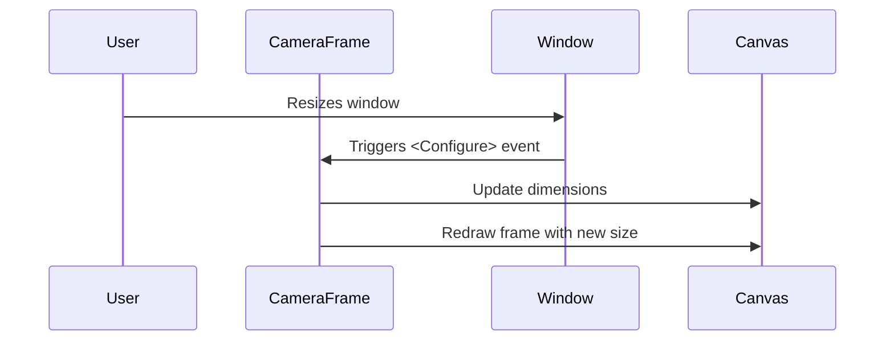
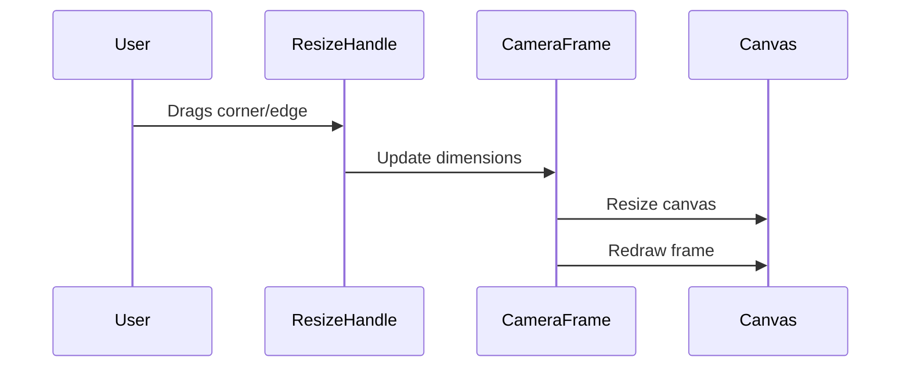

# Video Frame Resize Implementation Plan

## Overview
Implement resizable video frames in the camera view with both automatic window resizing and manual resize controls.

## Implementation Details

### 1. Automatic Window Resizing

- Bind to window `<Configure>` event to detect size changes
- Update canvas dimensions dynamically
- Maintain aspect ratio during resizing
- Implement smooth frame redrawing

### 2. Manual Resize Controls

- Add resize handles to corners/edges
- Implement drag functionality
- Update dimensions based on drag position
- Maintain minimum/maximum size constraints

## Technical Requirements

1. Window Event Handling:
   - Implement `on_configure` method in CameraFrame
   - Track window size changes
   - Throttle resize events for performance

2. Canvas Updates:
   - Dynamic canvas resizing
   - Maintain aspect ratio
   - Efficient frame redrawing
   - Handle frame buffer updates

3. Resize Controls:
   - Corner/edge resize handles
   - Drag interaction logic
   - Size constraint enforcement
   - Visual feedback during resize

4. Performance Optimizations:
   - Throttle resize events
   - Optimize frame redrawing
   - Efficient memory management
   - Smooth resize animations

## Implementation Steps

1. Modify CameraFrame class:
   - Add window resize event handling
   - Implement canvas resize logic
   - Add size constraints

2. Create ResizeHandle component:
   - Corner/edge handle widgets
   - Drag interaction logic
   - Size update calculations

3. Update frame rendering:
   - Optimize frame scaling
   - Implement smooth transitions
   - Handle aspect ratio maintenance

4. Testing:
   - Verify resize behavior
   - Check performance impact
   - Test edge cases
   - Validate user experience

## Next Steps

1. Switch to Code mode for implementation
2. Start with automatic window resizing
3. Add manual resize controls
4. Test and optimize performance