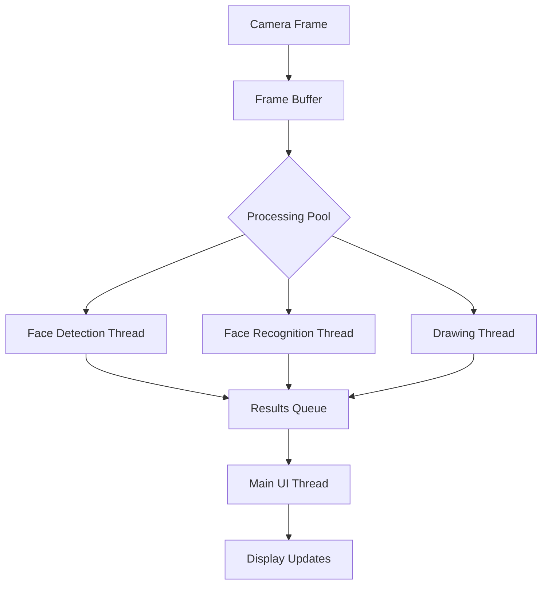

# Multi-Threading Implementation Plan

## Overview

This document outlines the plan for implementing multi-threading improvements to increase speed and FPS in the face detection and recognition system.

## Architecture



## Implementation Components

### 1. Processing Pools

Create dedicated thread pools for different processing stages:

```python
class FaceDetectionPool:
    def __init__(self, num_workers=4):
        self.detection_queue = Queue()
        self.result_queue = Queue()
        self.workers = []
```

### 2. Parallel Face Detection

- Create worker threads for face detection
- Process multiple ROIs concurrently
- Implement thread-safe result collection

### 3. Concurrent Face Recognition

```python
class RecognitionPool:
    def __init__(self, num_workers=2):
        self.recognition_queue = Queue()
        self.result_queue = Queue()
```

### 4. Asynchronous Drawing

- Separate drawing thread
- Double buffering
- Thread-safe frame management

## File Structure

```
src/
  utils/
    parallel/
      __init__.py
      detection_pool.py
      recognition_pool.py
      drawing_pool.py
      frame_buffer.py
```

## Technical Considerations

1. Thread Safety
   - Thread-safe queues
   - Proper locking mechanisms
   - Resource cleanup

2. Memory Management
   - Frame buffer pooling
   - Efficient memory usage
   - Resource cleanup

3. Error Handling
   - Worker thread error handling
   - Graceful degradation
   - Resource cleanup on errors

4. Configuration
   - Configurable thread pool sizes
   - Adjustable queue sizes
   - Processing priorities

## Performance Metrics

- Monitor thread pool utilization
- Track processing times per stage
- Memory usage tracking
- FPS measurements

## Implementation Steps

1. Create basic thread pool infrastructure
2. Implement face detection workers
3. Add face recognition workers
4. Set up drawing thread
5. Add performance monitoring
6. Implement configuration system
7. Add error handling
8. Optimize based on metrics

## Expected Benefits

- Increased FPS through parallel processing
- Better resource utilization
- Reduced main thread blocking
- Improved UI responsiveness