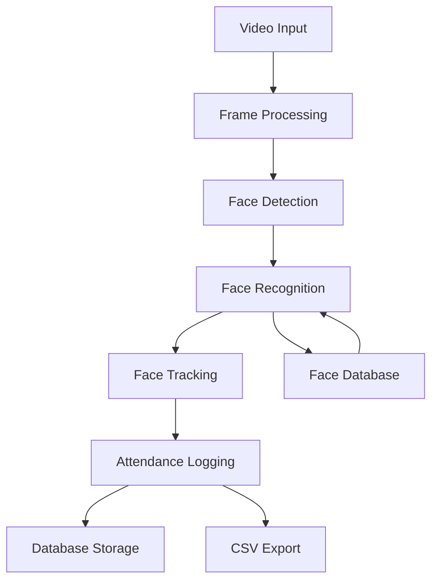

# Technical Stack Documentation

## Core Technologies

### Programming Language
- **Python 3.7+**
  - Primary development language
  - Extensive support for AI/ML libraries
  - Rich ecosystem of computer vision packages

### GUI Framework
- **Tkinter**
  - Native Python GUI toolkit
  - Used for building the desktop interface
  - Provides widgets and event handling
  - Custom dialog implementations

### Computer Vision & AI
- **OpenCV (cv2)**
  - Video capture and processing
  - Image manipulation and preprocessing
  - Frame scaling and transformation
  - Drawing utilities for visualization

- **InsightFace**
  - Deep learning-based face detection
  - Face recognition and embedding generation
  - Facial landmark detection
  - Pre-trained models for accurate recognition

### Database
- **SQLAlchemy**
  - ORM (Object-Relational Mapping)
  - Database schema management
  - Relationship handling
  - Query optimization

- **SQLite**
  - Local database storage
  - ACID compliance
  - Single-file database
  - No separate server required

### File Storage
- **CSV**
  - Attendance log storage
  - Simple data format
  - Easy export and analysis
  - Human-readable format

- **Pickle**
  - Face embedding storage
  - Binary serialization
  - Efficient data storage
  - Fast loading/saving

## Implementation Details

### Face Recognition Pipeline
1. **Video Input**
   ```python
   cv2.VideoCapture(0)
   ```
   - Full HD resolution (1920x1080)
   - 30 FPS capture
   - Configurable buffer size

2. **Frame Processing**
   ```python
   preprocess_frame(frame, processing_width)
   ```
   - Frame scaling
   - Color space conversion
   - Resolution optimization

3. **Face Detection**
   ```python
   face_app.get(small_frame)
   ```
   - InsightFace detector
   - Multi-scale detection
   - Confidence scoring

4. **Face Recognition**
   ```python
   recognize_face(face_embedding)
   ```
   - Embedding comparison
   - Distance-aware weighting
   - Multi-scale recognition
   - Confidence thresholding

### Face Tracking System
1. **Tracker Creation**
   ```python
   create_tracker()
   ```
   - OpenCV tracker implementation
   - Configurable tracking parameters

2. **Tracking Update**
   ```python
   tracker.update(small_frame)
   ```
   - Frame-by-frame tracking
   - Bounding box updates
   - Confidence validation

### Database Schema
1. **User Model**
   ```python
   class User(Base):
       id = Column(Integer, primary_key=True)
       name = Column(String, nullable=False)
       created_at = Column(DateTime, default=datetime.utcnow)
   ```

2. **Face Sample Model**
   ```python
   class FaceSample(Base):
       id = Column(Integer, primary_key=True)
       user_id = Column(Integer, ForeignKey('users.id'))
       image_path = Column(String, nullable=False)
   ```

3. **Attendance Model**
   ```python
   class Attendance(Base):
       id = Column(Integer, primary_key=True)
       user_id = Column(Integer, ForeignKey('users.id'))
       date = Column(DateTime, default=date.today)
       check_in_time = Column(DateTime)
       check_out_time = Column(DateTime)
   ```

### Libraries & Dependencies

```txt
Core Requirements:
- opencv-python>=4.5.0
- numpy>=1.19.0
- insightface>=0.6.0
- sqlalchemy>=1.4.0
- pillow>=8.0.0
- scipy>=1.7.0

Optional Dependencies:
- pandas (for attendance data analysis)
- matplotlib (for visualization)
- onnxruntime (for optimized model inference)
```

## Data Flow Architecture



## Performance Considerations

### Memory Management
- Frame buffer optimization
- Face embedding caching
- Database connection pooling
- Image preprocessing optimization

### CPU Utilization
- Multi-threading for video processing
- Periodic face detection
- Efficient tracking algorithms
- Optimized database queries

### Storage Efficiency
- Binary face embedding storage
- Compressed image storage
- Efficient database indexing
- Regular cleanup of old records