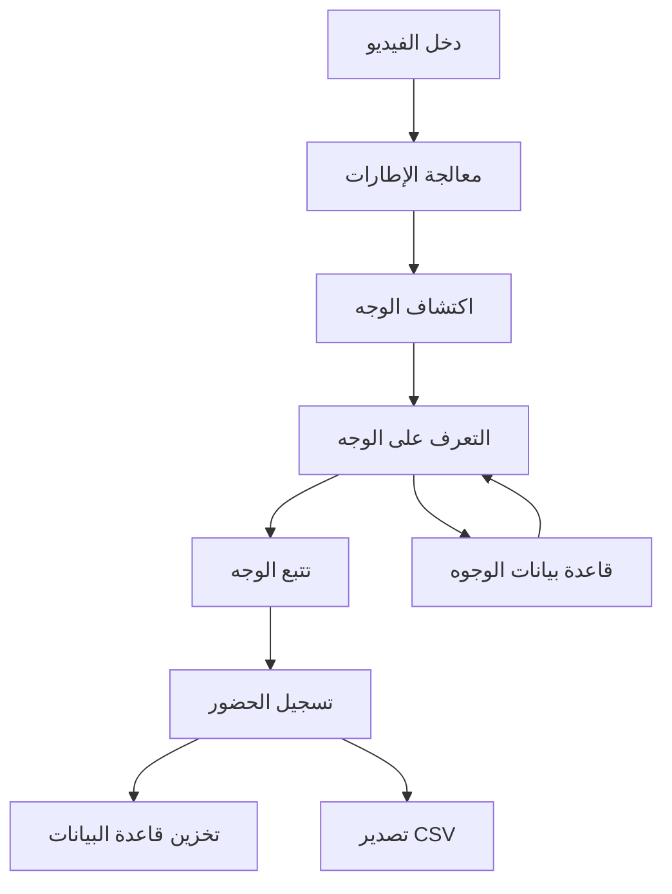

# توثيق المكونات التقنية

## التقنيات الأساسية

### لغة البرمجة
- **Python 3.7+**
  - لغة التطوير الأساسية
  - دعم واسع لمكتبات الذكاء الاصطناعي والتعلم الآلي
  - نظام بيئي غني بحزم الرؤية الحاسوبية

### إطار واجهة المستخدم
- **Tkinter**
  - مجموعة أدوات واجهة المستخدم الرسومية الأصلية لبايثون
  - مستخدمة لبناء واجهة سطح المكتب
  - توفر الأدوات ومعالجة الأحداث
  - تنفيذات مربعات حوار مخصصة

### الرؤية الحاسوبية والذكاء الاصطناعي
- **OpenCV (cv2)**
  - التقاط ومعالجة الفيديو
  - معالجة الصور والمعالجة المسبقة
  - تحجيم وتحويل الإطارات
  - أدوات الرسم للتصور

- **InsightFace**
  - اكتشاف الوجه المعتمد على التعلم العميق
  - التعرف على الوجه وتوليد التضمين
  - اكتشاف المعالم الوجهية
  - نماذج مدربة مسبقاً للتعرف الدقيق

### قاعدة البيانات
- **SQLAlchemy**
  - التخطيط العلائقي للكائنات (ORM)
  - إدارة مخطط قاعدة البيانات
  - معالجة العلاقات
  - تحسين الاستعلامات

- **SQLite**
  - تخزين قاعدة البيانات المحلية
  - الامتثال لـ ACID
  - قاعدة بيانات ملف واحد
  - لا يتطلب خادم منفصل

### تخزين الملفات
- **CSV**
  - تخزين سجل الحضور
  - تنسيق بيانات بسيط
  - سهولة التصدير والتحليل
  - تنسيق قابل للقراءة البشرية

- **Pickle**
  - تخزين تضمين الوجه
  - تسلسل ثنائي
  - تخزين بيانات فعال
  - تحميل/حفظ سريع

## تفاصيل التنفيذ

### خط معالجة التعرف على الوجه
1. **دخل الفيديو**
   ```python
   cv2.VideoCapture(0)
   ```
   - دقة كاملة (1920×1080)
   - التقاط 30 إطار في الثانية
   - حجم المخزن المؤقت قابل للتكوين

2. **معالجة الإطارات**
   ```python
   preprocess_frame(frame, processing_width)
   ```
   - تحجيم الإطار
   - تحويل مساحة الألوان
   - تحسين الدقة

3. **اكتشاف الوجه**
   ```python
   face_app.get(small_frame)
   ```
   - كاشف InsightFace
   - اكتشاف متعدد المقاييس
   - تسجيل الثقة

4. **التعرف على الوجه**
   ```python
   recognize_face(face_embedding)
   ```
   - مقارنة التضمين
   - ترجيح يراعي المسافة
   - تعرف متعدد المقاييس
   - عتبة الثقة

### نظام تتبع الوجه
1. **إنشاء المتتبع**
   ```python
   create_tracker()
   ```
   - تنفيذ متتبع OpenCV
   - معلمات تتبع قابلة للتكوين

2. **تحديث التتبع**
   ```python
   tracker.update(small_frame)
   ```
   - تتبع إطار بإطار
   - تحديثات المربع المحيط
   - التحقق من الثقة

### مخطط قاعدة البيانات
1. **نموذج المستخدم**
   ```python
   class User(Base):
       id = Column(Integer, primary_key=True)
       name = Column(String, nullable=False)
       created_at = Column(DateTime, default=datetime.utcnow)
   ```

2. **نموذج عينة الوجه**
   ```python
   class FaceSample(Base):
       id = Column(Integer, primary_key=True)
       user_id = Column(Integer, ForeignKey('users.id'))
       image_path = Column(String, nullable=False)
   ```

3. **نموذج الحضور**
   ```python
   class Attendance(Base):
       id = Column(Integer, primary_key=True)
       user_id = Column(Integer, ForeignKey('users.id'))
       date = Column(DateTime, default=date.today)
       check_in_time = Column(DateTime)
       check_out_time = Column(DateTime)
   ```

### المكتبات والتبعيات

```txt
المتطلبات الأساسية:
- opencv-python>=4.5.0
- numpy>=1.19.0
- insightface>=0.6.0
- sqlalchemy>=1.4.0
- pillow>=8.0.0
- scipy>=1.7.0

التبعيات الاختيارية:
- pandas (لتحليل بيانات الحضور)
- matplotlib (للتصور)
- onnxruntime (لاستدلال النموذج المحسن)
```

## بنية تدفق البيانات



## اعتبارات الأداء

### إدارة الذاكرة
- تحسين المخزن المؤقت للإطارات
- تخزين مؤقت لتضمين الوجه
- تجميع اتصالات قاعدة البيانات
- تحسين المعالجة المسبقة للصور

### استخدام المعالج
- تعدد المسارات لمعالجة الفيديو
- اكتشاف دوري للوجه
- خوارزميات تتبع فعالة
- استعلامات قاعدة بيانات محسنة

### كفاءة التخزين
- تخزين تضمين الوجه الثنائي
- تخزين الصور المضغوطة
- فهرسة فعالة لقاعدة البيانات
- تنظيف منتظم للسجلات القديمة